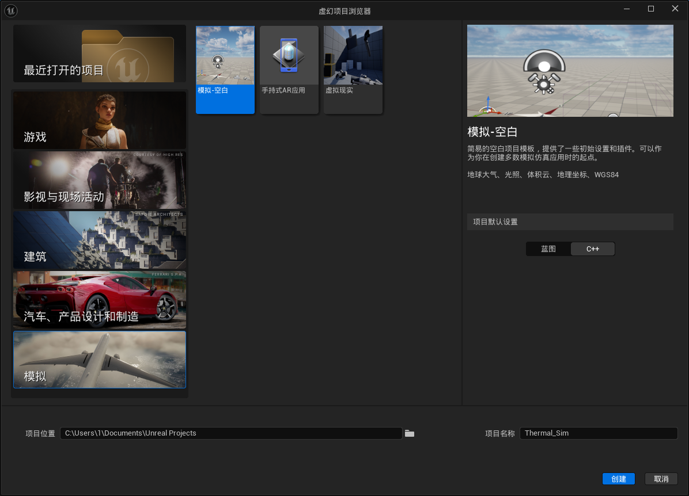
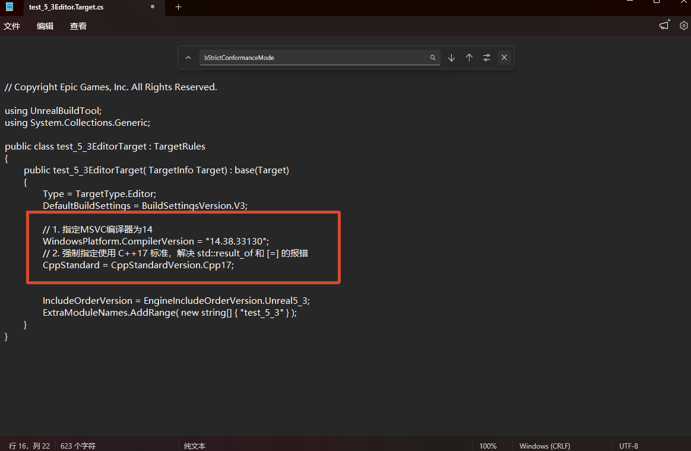
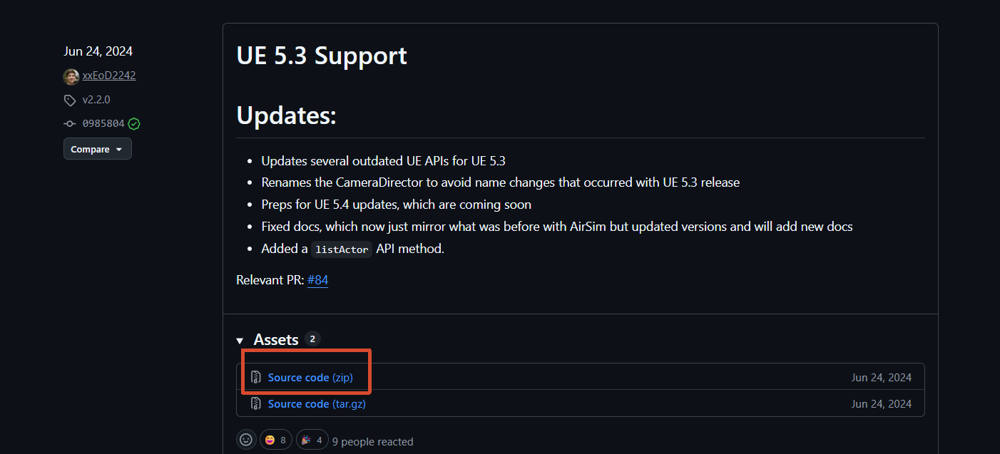
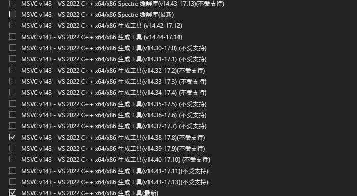
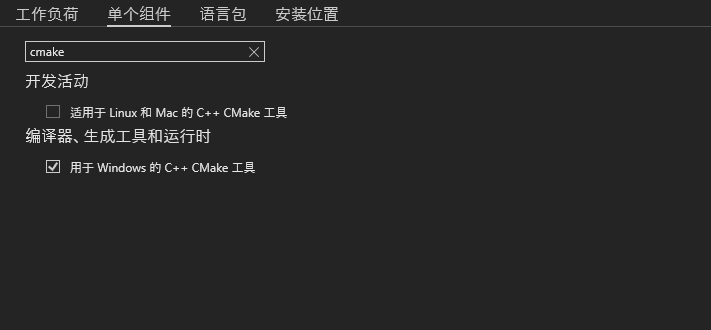
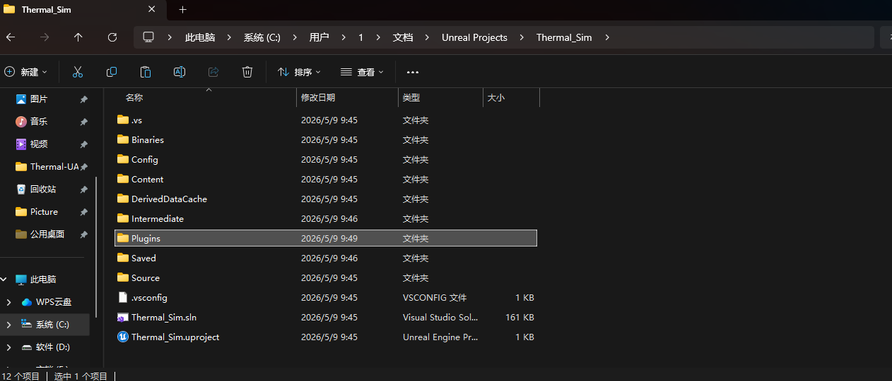

# Windows

**一、UE 5.3.2 安装**

1. 官网下载Epic Games，随后在虚幻引擎中下载UE 5.3.2版本
2. 下载完成后，打开，创建项目 模拟→模拟-空白→C++，如果提示缺乏2022 VS，点击安装，具体安装内容见下面步骤。



3. 用记事本打开`项目名/Source/项目名Editor.Target.cs`，添加以下内容



```c# title="内容如下"
// 1. 指定MSVC编译器为14.38
WindowsPlatform.CompilerVersion = "14.38.33130"; 
// 2. 强制指定使用 C++17 标准，解决 std::result_of 和 [=] 的报错
CppStandard = CppStandardVersion.Cpp17;
```

**二、Colosseum-UE-5.3 安装**

1. 安装Colosseum-UE-5.3



2. 安装VS 2022 Communtiy

- 工作负荷中选择安装`.NET 桌面开发`、`使用C++的桌面开发`、`使用C++的游戏开发`。


- 单个组件中搜索MSVC安装`MSVC 14.38-17.8`、`MSVC 最新`；搜索cmake安装`用于Windows的C++CMake工具`





3. 以管理员身份启动 Developer Command Prompt for VS 2022，运行build.cmd

**注意：**

```markdown 
# 用于查看当前MSVC版本是否是19.38
cl
```

**三、Colosseum插件移植到UE中**

1. 将构建的Unreal/Plugins文件复制到当前UE项目文件下面



2. 以记事本打开`*.uproject`，补充添加以下内容，如果有其他插件，注意两两逗号隔开，**后面发现这一步不用也可以**

```json 
"Plugins": [
    {
        "Name": "AirSim",
        "Enabled": true
    }
]
```

3. 双击`*.uproject`打开，选择yes，同意编译Airsim插件

4. 修改`C:\Users\1\Documents\AirSim\setting.json`文件，补充添加

```json title="更换为无人机"
{
  "SettingsVersion": 1.2,
  "SimMode": "Multirotor"
}
```

5. 选择AirSimGame模式，随后运行


6. 撰写控制脚本

- 安装相关库

```markdown 
pip install msgpack-rpc-python
pip install backports.ssl_match_hostname
pip install "numpy<2.0.0"
pip install airsim
pip install pygame
```


- 控制代码样例

```python 
import sys
import time
import math
import airsim
import pygame

# >------>>>  pygame 窗口设置   <<<------< #
pygame.init()
screen = pygame.display.set_mode((400, 300))
pygame.display.set_caption('AirSim Controller - 必须点击此窗口才有效！')
screen.fill((0, 50, 0)) # 设置为暗绿色提醒你焦点在这里
pygame.display.flip()

# >------>>>  AirSim 连接设置   <<<------< #
vehicle_name = ""  # 默认无人机名字为空字符串
print("正在连接虚幻引擎...")
try:
    client = airsim.MultirotorClient()
    client.confirmConnection()
    client.enableApiControl(True, vehicle_name=vehicle_name)
    client.armDisarm(True, vehicle_name=vehicle_name)
    print("电机已解锁，准备起飞...")
    client.takeoffAsync(vehicle_name=vehicle_name).join()
    print("起飞成功！请用鼠标点击那个绿色的小窗口开始控制。")
except Exception as e:
    print(f"连接或起飞失败，请检查 UE 是否正在运行: {e}")
    sys.exit()

# >------>>>  核心控制参数   <<<------< #
# 基础速度设置
base_velocity = 5.0  
speedup_ratio = 2.0  
base_yaw_rate = 30.0 

# 惯性平滑参数 (0.0 到 1.0 之间，值越小手感越平滑，值越大越像电子竞技)
smooth_factor = 0.15 

# 当前实际速度 (初始化为0)
current_vx, current_vy, current_vz, current_yaw = 0.0, 0.0, 0.0, 0.0

clock = pygame.time.Clock()
_last_print_time = 0.0  # 控制打印冷却，避免刷屏

print("\n--- 操作指南 (记得关闭中文输入法) ---")
print("↑/↓: 前进/后退")
print("←/→: 左右平移")
print("W/S: 升高/下降")
print("A/D: 左转/右转机头")
print("空格: 按住加速")
print("ESC: 降落并退出")
print("-----------------------------------\n")

try:
    while True:
        # 将循环频率锁定为 30Hz，防止网络指令拥堵
        clock.tick(30)

        # 处理直接关掉窗口的事件
        for event in pygame.event.get():
            if event.type == pygame.QUIT:
                raise KeyboardInterrupt

        keys = pygame.key.get_pressed()

        # 按下 ESC 降落退出
        if keys[pygame.K_ESCAPE]:
            print("收到退出指令，准备降落...")
            break

        # 如果按下空格，速度翻倍
        scale = speedup_ratio if keys[pygame.K_SPACE] else 1.0

        # 1. 采集按键，计算【目标期望速度】 (NED坐标系)
        target_vx, target_vy, target_vz, target_yaw = 0.0, 0.0, 0.0, 0.0

        if keys[pygame.K_UP]:    target_vx = base_velocity * scale
        if keys[pygame.K_DOWN]:  target_vx = -base_velocity * scale
        
        if keys[pygame.K_RIGHT]: target_vy = base_velocity * scale
        if keys[pygame.K_LEFT]:  target_vy = -base_velocity * scale
        
        if keys[pygame.K_w]:     target_vz = -base_velocity * scale  # Z轴向上为负
        if keys[pygame.K_s]:     target_vz = base_velocity * scale
        
        if keys[pygame.K_d]:     target_yaw = base_yaw_rate * scale
        if keys[pygame.K_a]:     target_yaw = -base_yaw_rate * scale

        # 2. 核心魔法：使用 Lerp 算法让当前速度平滑过渡到目标速度
        current_vx += (target_vx - current_vx) * smooth_factor
        current_vy += (target_vy - current_vy) * smooth_factor
        current_vz += (target_vz - current_vz) * smooth_factor
        current_yaw += (target_yaw - current_yaw) * smooth_factor

        # 3. 发送平滑后的指令给引擎 (BodyFrame 代表以无人机机头为正前方)
        client.moveByVelocityBodyFrameAsync(
            vx=current_vx, vy=current_vy, vz=current_vz, 
            duration=0.1,  # 持续时间设为0.1秒，覆盖网络延迟
            yaw_mode=airsim.YawMode(True, current_yaw), 
            vehicle_name=vehicle_name
        )

        # 4. 当有移动按键按下时，打印当前指令状态（纯本地数据，无网络调用）
        any_move_key = (target_vx != 0.0 or target_vy != 0.0 or
                        target_vz != 0.0 or target_yaw != 0.0)
        now = time.time()
        if any_move_key and now - _last_print_time >= 0.3:
            _last_print_time = now
            print(
                f"\r[指令速度] Vx:{current_vx:>6.2f} Vy:{current_vy:>6.2f} Vz:{current_vz:>6.2f} m/s  "
                f"[偏航速率] {current_yaw:>6.2f} °/s  "
                f"[加速模式] {'是' if keys[pygame.K_SPACE] else '否'}",
                end="", flush=True
            )

except KeyboardInterrupt:
    # 捕获 Ctrl+C 或强退事件，安全降落
    pass
finally:
    print("\n正在降落并释放控制权...")
    try:
        client.landAsync(vehicle_name=vehicle_name).join()
        client.armDisarm(False, vehicle_name=vehicle_name)
        client.enableApiControl(False, vehicle_name=vehicle_name)
    except:
        pass
    pygame.quit()
    print("任务结束！")
```

7. 解决python控制时的卡顿问题

编辑→编辑器偏好设置→搜索`cpu`→取消勾选`处于背景中时占用较少CPU`

# Ubuntu 24.04

**一、UE 5.3.2安装**

1. 下载网站

链接：[https://www.unrealengine.com/linux?lang=zh-CN](https://www.unrealengine.com/linux?lang=zh-CN "https://www.unrealengine.com/linux?lang=zh-CN")

选择：Linux\_Unreal\_Engine\_5.3.2.zip

2. 启动脚本： ./Engine/Binaries/Linux/UnrealEditor

```bash title="如果缺乏py3.11的动态链接库"
# 如果缺乏 py3.11 的动态链接库
sudo add-apt-repository ppa:deadsnakes/ppa
sudo apt update
sudo apt install libpython3.11

unset PYTHONHOME
unset PYTHONPATH

```

3. 将UE添加到桌面快捷方式打开

- 创建一个快捷方式并用Gedit打开

```bash 
touch UE5.desktop
gedit UE5.desktop

```


- 输入，需补充自己的`UnrealEditor`路径

```ini 
[Desktop Entry]
Type=Application
Name=启动 UE5
Comment=Launch Unreal Engine with Python Fix
Exec=bash -c "unset PYTHONHOME; unset PYTHONPATH; cd '/home/zxr/Fighting/UE_5_3_2/Engine/Binaries/Linux'; ./UnrealEditor; exec bash" # 对照补全为你的UE路径
Icon=utilities-terminal
Terminal=true
```


- 修改权限

```bash 
chmod 444 UE5.desktop
```


- 右键文件选择允许运行
- 双击即可运行UE

**二、Colosseum 2.3.0安装过程**

1. 打开`setup.sh`文件，搜索`vulkan-utils`并替换为`vulkan-tools`
2. 打开终端，运行

```bash 
./setup.sh
```

***注意：*** 如果出现Could not find compiler set in environment variable CC: /usr/bin/clang-18

```bash title="补全clang-18编译器"
sudo apt-get install clang-18 lld-18 libc++-18-dev libc++abi-18-dev -y
## 设置clang的默认输出结果
sudo update-alternatives --install /usr/bin/clang clang /usr/bin/clang-18 100
sudo update-alternatives --install /usr/bin/clang++ clang++ /usr/bin/clang++-18 100
```

3. 随后运行

```bash 
./build.sh
```

**三、Colosseum插件移植到UE中**

1. 将Colosseum/Unreal/Plugins/**AirSim**文件夹复制到项目文件中**第一层目录的Plugins**文件夹下，若没有这个文件夹，就创建它。
2. 修改其中的 \*.uproject，用gedit打开，添加：

```markdown 
"Plugins": [
    {
        "Name": "AirSim",
        "Enabled": true
    }
]
```

3. 找到`Plugins/AirSim/Source/AirSim.Build.cs`脚本，搜索并定位到case并添加：

```markdown 
# 将下面
  case CompileMode.CppCompileWithRpc:
      LoadAirSimDependency(Target, "rpclib", "rpc");
      break;

# 替换为
  case CompileMode.CppCompileWithRpc:
      LoadAirSimDependency(Target, "rpclib", "rpc");
      AddLibDependency("AirLib", Path.Combine(AirLibPath, "lib"),
      "AirLib", Target, false);
      break;
```

4. 双击第一步创建的快捷方式，打开UE，弹出是否编译Airsim插件后，同意。

5. 完成

***注意：***

- 若是重新编译，或更换插件。请先运行

```bash 
rm -rf Binaries Intermediate Saved
```


- 移植的第3步debug过程如下

```markdown 
# [Fix] Linux Build Linker Error: Undefined symbols for `msr::airlib` classes

## Environment

* **OS:** Linux (Tested on Ubuntu/CentOS)
* **Unreal Engine Version:** 5.4.4
* **Plugin:** AirSim

## Description

When attempting to build the AirSim Unreal Engine project on Linux, the build fails during the final linking phase for `libUnrealEditor-AirSim.so`. The linker throws multiple `undefined symbol` errors related to core `msr::airlib` functions. 

Example errors from the log:

```text
ld.lld: error: undefined symbol: msr::airlib::RpcLibServerBase::RpcLibServerBase(...)
ld.lld: error: undefined symbol: msr::airlib::CarRpcLibServer::CarRpcLibServer(...)
ld.lld: error: undefined symbol: msr::airlib::MultirotorRpcLibServer::MultirotorRpcLibServer(...)
ld.lld: error: undefined symbol: vtable for msr::airlib::MultirotorApiBase
## Root Cause

The issue lies in the plugin's `Source/AirSim.Build.cs` script.

In the `SetupCompileMode` method, the build script configures library dependencies based on the selected `CompileMode`. For `CompileMode.CppCompileWithRpc`, the script successfully loads the `rpclib` dependency but **omits the instruction to load the core `AirLib` dependency**.

Because `AirLib` is never passed to `PublicAdditionalLibraries` in this mode, the linker cannot resolve any of the core AirSim API server implementations, resulting in the build crash.

## Solution

To fix this, the `AirLib` dependency needs to be explicitly added to the `CompileMode.CppCompileWithRpc` switch case.

### Changes Required

**File:** `Plugins/AirSim/Source/AirSim.Build.cs`

**Before:**
        case CompileMode.CppCompileWithRpc:
                LoadAirSimDependency(Target, "rpclib", "rpc");
                break;
**After:**        
  		case CompileMode.CppCompileWithRpc:
                LoadAirSimDependency(Target, "rpclib", "rpc");
                AddLibDependency("AirLib", Path.Combine(AirLibPath, "lib"), "AirLib", Target, false);
                break;
                
By adding the `AddLibDependency` call for `AirLib`, the static library (`libAirLib.a` on Linux) is correctly linked, and the project compiles successfully.
```
